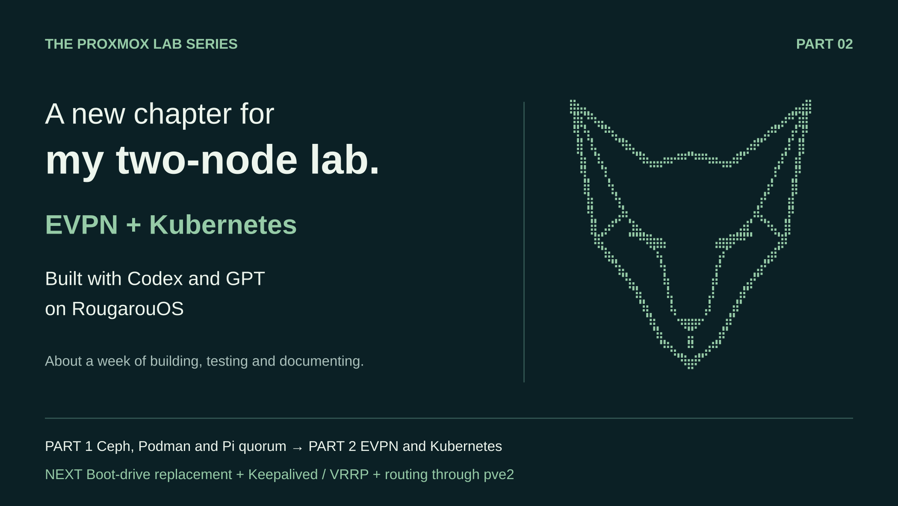

# Proxmox EVPN → Kubernetes → an HTTPS wiki

A companion to Kristopher Knight's Proxmox lab series. Part 2 builds on [the original Ceph, Podman and Raspberry Pi lab](https://medium.com/@virtualdata/how-i-built-a-2-node-ha-proxmox-cluster-with-ceph-podman-and-a-raspberry-pi-yes-it-works-5887a25a7022), with EVPN, Kubernetes, shared HTTPS and an operations wiki. Codex and GPT on RougarouOS helped build, test and document the environment.

This repository uses **actual lab addresses and selected nonsecret configurations**. The [installed lab reference](docs/lab-reference.md) describes the running four-node cluster. The walkthrough below uses the separate two-VM acceptance layout, on the same existing EVPN network. Those test VMs were removed. Reserve unused IDs and addresses in your own environment before running anything; neither list is an allocation service.

Read [network prerequisites](docs/network.md), [test results and limits](evidence/acceptance.md), [the build timeline](docs/build-timeline.md), and [operations coverage](docs/operations.md). Credentials, TLS private keys, kubeconfigs and private workspace logs are excluded.



## Prerequisites and scope

- Two functioning Proxmox 9 hosts, a direct 10 GbE link, FRR, and a configured EVPN VNet. See [network setup](docs/network.md).
- Working guest DNS and outbound HTTPS to official package/image registries. VM/node firewall rules must allow the [Kubernetes ports](https://kubernetes.io/docs/reference/networking/ports-and-protocols/) and chosen Cilium dataplane. Do not assume this guide supplies a firewall policy.
- Fresh Rocky Linux 9.8 x86_64 GenericCloud guests; root access on Proxmox and passwordless sudo for guest preparation. Each node gets 2 vCPU, 4 GiB RAM and a 32 GiB disk. Scripts change containerd, SELinux to permissive, NetworkManager interface handling and swap on these dedicated nodes.
- A verified cloud-image SHA256, an authorized SSH public key, and reserved unused VM IDs/IPs. VM creation does not guarantee DNS/IPAM registration.
- Python3 with venv/pip on the workstation; kubectl matching the cluster; private TLS material supplied separately.

Pinned: Kubernetes 1.35.9, containerd 2.3.6-1.el9, Cilium 1.20.2, Cilium CLI v0.20.1, Gateway API v1.6.1 experimental CRDs, MkDocs 1.6.1/Material 9.7.6, digest-pinned Nginx. These are an October 2026 tested snapshot, not a promise about future supported versions or repository retention. Read upstream upgrade notes before changing pins. Rocky's vendor 5.14 kernel emits a kubeadm LTS warning; record and evaluate that warning for your deployment.

## 1. Create fresh VMs

On each intended Proxmox host, copy `scripts/create-vm.sh` and your public key. Set `VM_ID`, `VM_NAME`, `VM_IP`, `STORAGE`, `CLOUD_IMAGE`, `IMAGE_SHA256`, `SSH_PUBLIC_KEY`, then run the script. It checks the ID across the cluster and verifies the image before creating anything. It never deletes an existing VM.

The installed design uses cp1 plus three workers. The disposable acceptance run used this smaller layout; use new, currently unused IDs if repeating it:

| Host | VM ID/name | Address | Storage |
|---|---|---|---|
| pve1 |9310/guide-cp|10.50.10.201|NVMe-Local-1|
| pve2 |9311/guide-worker|10.50.10.202|NVMe-Local-2|

The publicly available tested image SHA256 is `92c206cc6f790c61583247eefe87890f8828420662c17cacf247cec78ab4eec8` for Rocky 9 GenericCloud Base 9.8 build 20260525.0. Check against the official Rocky checksum for the image you actually download. Do not use the hash for a different image.

## 2. Bootstrap Kubernetes

Copy `scripts/prepare-node.sh` to every fresh VM and run `bash prepare-node.sh`. Wait for cloud-init to complete. For the control plane, copy both bootstrap scripts and run:

```bash
# Control plane; use distinct ranges if another cluster shares the VNet.
export NODE_IP=10.50.10.201
export POD_CIDR=10.245.0.0/16
export SERVICE_CIDR=10.112.0.0/12
bash init-control-plane.sh
```

This initializes kubeadm with systemd cgroups and kube-proxy disabled. An optional `API_ENDPOINT` hostname must resolve correctly before initialization. The installed four-node cluster uses 10.244.0.0/16 and 10.96.0.0/12; the disposable acceptance cluster uses 10.245.0.0/16 and 10.112.0.0/12. Avoid overlap with any existing cluster.

Generate a short-lived join command on the control plane:

```bash
sudo kubeadm token create --ttl 30m --print-join-command
```

Run the returned command with sudo on each prepared worker. Keep its token private. Then on the control plane:

```bash
NODE_IP=10.50.10.201 POD_CIDR=10.245.0.0/16 bash install-cilium.sh
kubectl get nodes -o wide
kubectl get pods -A -o wide
cilium status
```

Install the Gateway API CRDs before Cilium. The script does that in order and pins the CLI download, checks its SHA256, then installs Cilium with native routing, MTU 1500, Gateway API and L2 announcements. Cilium auto-direct routing assumes node IPs share the L2 segment. It introduces no second VXLAN tunnel in this mode.

## 3. Label failure domains and eligible announcers

Label each node with its actual physical host. For a full four-VM cluster, leave the control-plane taint in place and have workers on both hosts.

```bash
kubectl label node guide-cp topology.kubernetes.io/zone=pve1 --overwrite
kubectl label node guide-worker topology.kubernetes.io/zone=pve2 --overwrite
kubectl label node guide-worker node-role.kubernetes.io/worker= --overwrite
kubectl get nodes -l 'node-role.kubernetes.io/worker=' -o wide
```

The empty worker-role value must match `wiki/gateway.yaml`. For the two-VM disposable acceptance cluster only, we allowed workload scheduling on its control plane so two wiki replicas could occupy different physical hosts:

```bash
kubectl taint nodes guide-cp node-role.kubernetes.io/control-plane-
```

This is a test-topology deviation from the author's three-worker cluster. It does not create a second control plane or make the API highly available.

## 4. Build and deploy the wiki

On the workstation, from this repository:

```bash
python3 -m venv .venv
.venv/bin/pip install -r wiki/requirements-lock.txt
.venv/bin/mkdocs build --strict -f wiki/mkdocs.yml
python3 scripts/publish-wiki.py wiki/site wiki.guide.test \
  "$(cat wiki/nginx-image.txt)" > wiki-resources.json
```

Before rollout, create namespace `lab-wiki` and Secret `wiki-tls` on the target cluster from your own certificate/key. The certificate SAN must contain `wiki.guide.test`, or the hostname you substituted throughout. Keep keys outside this repository. For an isolated two-day acceptance test, generate a disposable self-signed certificate on a trusted operator machine:

```bash
kubectl create namespace lab-wiki --dry-run=client -o yaml | kubectl apply -f -
umask 077
mkdir -p /tmp/guide-tls
openssl req -x509 -newkey rsa:2048 -nodes -days 2 \
  -keyout /tmp/guide-tls/tls.key -out /tmp/guide-tls/tls.crt \
  -subj /CN=wiki.guide.test -addext subjectAltName=DNS:wiki.guide.test \
  -addext basicConstraints=critical,CA:FALSE
kubectl -n lab-wiki create secret tls wiki-tls \
  --cert=/tmp/guide-tls/tls.crt --key=/tmp/guide-tls/tls.key
```

For a durable site, use your trusted CA and certificate lifecycle instead. No private key or kubeconfig is included here.

Apply using **server-side apply**; ordinary client-side apply can exceed the 262144-byte annotation limit for compressed content ConfigMaps.

```bash
kubectl apply --server-side --field-manager=wiki-guide --dry-run=server -f wiki-resources.json
kubectl apply --server-side --field-manager=wiki-guide -f wiki-resources.json
kubectl -n lab-wiki rollout status deployment/lab-wiki --timeout=240s
kubectl -n lab-wiki get pods -o wide
kubectl -n lab-wiki get svc,endpointslices
```

Two replicas require two schedulable physical-host zones. Content lives in immutable revisioned ConfigMaps; init containers unpack into emptyDir. No PVC is needed. Rebuild from your Markdown source to publish changes. Retain old revision ConfigMaps while old ReplicaSets may need them for rollback; clean them up deliberately after rollback retention expires.

## 5. Publish HTTPS

Reserve an unused VIP first. Our isolated test used `10.50.10.210`, with no VM interface assigned that address. Review `wiki/gateway.yaml`: adjust the VIP, hostname, role selector, and interface regex for your cluster. The tested guest NIC is eth0.

```bash
kubectl apply --server-side --field-manager=wiki-guide --dry-run=server -f wiki/gateway.yaml
kubectl apply --server-side --field-manager=wiki-guide -f wiki/gateway.yaml
kubectl -n lab-wiki get gateway,tlsroute,httproute,svc
kubectl -n lab-wiki get gateway wiki-guide -o yaml
kubectl -n kube-system get leases | grep cilium-l2announce
```

Confirm Gateway `Accepted` and `Programmed`, route `Accepted`/`ResolvedRefs`, Service VIP allocation, and its external traffic policy `Cluster`. The pool selects only this Gateway's generated Service. L2 announcements are beta; their worker election depends on the Kubernetes API.

From an allowed routed client or VNet guest, use curl without changing DNS:

```bash
curl --noproxy '*' --max-time 15 --cacert /tmp/guide-tls/tls.crt \
  --resolve wiki.guide.test:443:10.50.10.210 https://wiki.guide.test/
curl --noproxy '*' --max-time 15 -I \
  --resolve wiki.guide.test:80:10.50.10.210 http://wiki.guide.test/
```

Expected: HTTPS 200 with the built wiki and HTTP 301 to HTTPS. Copy only the public certificate to another test client if needed; never its key. For browser access, publish the DNS name and trust your CA through your normal client process. This walkthrough creates no router forwarding rule and supplies no application authentication or source-CIDR access policy. Restrict it to intended clients before treating it as a durable service.

## Access and optional extensions

[VRF-aware guest SSH](docs/network.md#guest-ssh-through-the-vrf) handles the documented asymmetric direct path. For workstation kubectl, securely copy admin.conf to a private mode 600 kubeconfig. Tunnel `127.0.0.1:16443` to the API through the guest SSH alias. In a copy, set server to `https://127.0.0.1:16443` and TLS server name to the API certificate's original IP or SAN hostname; preserve CA/client credentials.

For the fresh test layout, after creating the SSH aliases:

```bash
# Workstation: use new file names so you preserve existing contexts.
install -d -m 700 ~/.kube
umask 077
scp guide-cp:.kube/config ~/.kube/guide-admin.conf
cp ~/.kube/guide-admin.conf ~/.kube/guide-tunnel.conf
kubectl --kubeconfig ~/.kube/guide-tunnel.conf config set-cluster kubernetes \
  --server=https://127.0.0.1:16443 --tls-server-name=10.50.10.201
# Keep this command running in a separate terminal:
ssh -N -o ExitOnForwardFailure=yes \
  -L 127.0.0.1:16443:10.50.10.201:6443 guide-cp
```

In the deployment terminal, use `export KUBECONFIG=$HOME/.kube/guide-tunnel.conf`, then verify `kubectl config current-context` and `kubectl get nodes -o wide`. The admin kubeconfig carries cluster-admin credentials; retain it privately. Use scoped credentials for ongoing integrations.

The installed Ledger and wiki share VIP `10.50.10.100`: Ledger terminates TLS at Cilium while the wiki uses TLS passthrough. Scoped egress and NFS storage are extensions, not prerequisites for the static wiki. See [extensions](docs/extensions.md), and [acceptance results](evidence/acceptance.md).

The [original deployment lessons](docs/deployment-lessons.md) explain backup preparation, pod-level checks, Cilium test exclusions and a NetworkManager route incident.

Part 3 is planned around replacing pve1's troubled boot drive, adding a floating upstream address with Keepalived/VRRP, and using that maintenance window to test routing through pve2. The replacement and failover design are not performed by these scripts.

## Figures

The `diagrams/` directory contains the cover and six technical figures as SVG and PNG. Regenerate them with `python3 make-diagrams.py`, using `rsvg-convert` and DejaVu fonts. The cover incorporates the author-supplied RougarouOS terminal art in `assets/wolf.txt`.
