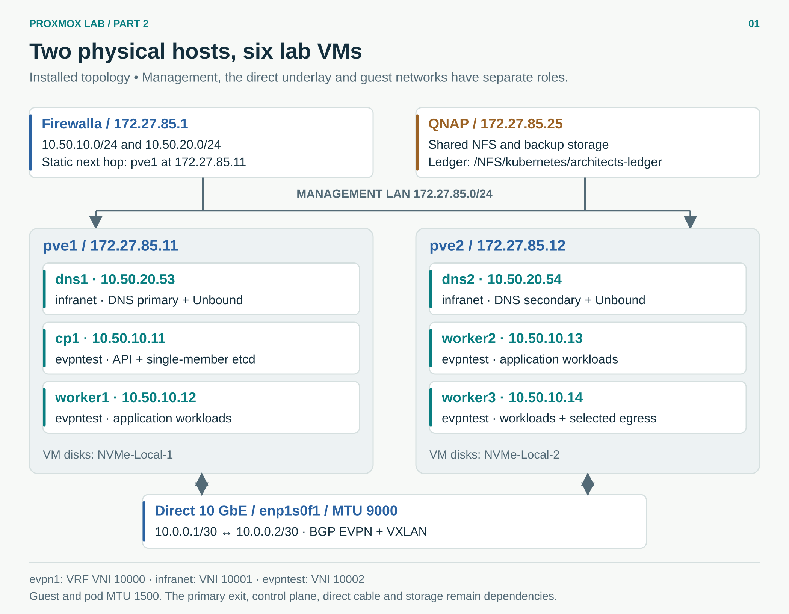

# Installed lab reference

These are the author's real lab addresses and selected configuration excerpts. They describe the four-node installation checked for the article on 3 October 2026. The [reader walkthrough](../README.md) creates a separate two-VM cluster. Substitute your own reserved addresses, interfaces, storage and authorized identities.

## Inventory

| System | Physical host / VM ID | Address | Role |
|---|---|---|---|
| pve1 | Physical | `172.27.85.11` | Proxmox; primary EVPN exit |
| pve2 | Physical | `172.27.85.12` | Proxmox; second EVPN exit |
| cp1 | pve1 / 120 | `10.50.10.11` | Sole API server and etcd member |
| worker1 | pve1 / 121 | `10.50.10.12` | Kubernetes worker |
| worker2 | pve2 / 122 | `10.50.10.13` | Kubernetes worker |
| worker3 | pve2 / 123 | `10.50.10.14` | Worker and selected Ledger egress gateway |
| dns1 | pve1 / 124 | `10.50.20.53` | PowerDNS primary and Unbound |
| dns2 | pve2 / 125 | `10.50.20.54` | PowerDNS secondary and Unbound |
| Firewalla | Upstream router | `172.27.85.1` | Routing, conditional DNS forwarding, external DNS |
| QNAP | NAS | `172.27.85.25` | NFS files and KNAPY backup storage |
| Monitoring | Existing Rocky VM | `172.27.85.30` | Prometheus, Grafana and other Docker services |
| RougarouOS | pve2 / 112 | `172.27.85.52` | Administration and agent workspaces |

Each Kubernetes guest has 2 vCPU, 4 GiB RAM and a 32 GiB boot disk; each DNS guest has 1 vCPU, 2 GiB and 12 GiB. Local VM storage IDs are `NVMe-Local-1` on pve1 and `NVMe-Local-2` on pve2. These six guests are the article's added platform, not the entire VM inventory of the hosts.

Installed versions: Proxmox VE 9.2.21, Rocky Linux 9.8, Kubernetes 1.35.9, containerd 2.3.6-1.el9, Cilium 1.20.2. The reader bootstrap pins Cilium CLI v0.20.1 and Gateway API v1.6.1 experimental CRDs. See [acceptance scope](../evidence/acceptance.md) before treating this as a supported production matrix.

## Networks and Proxmox objects



| Layer | Configuration |
|---|---|
| Management | `vmbr0` through `eno1`, MTU 1500; default route via `172.27.85.1` |
| Direct link | `enp1s0f1`; pve1 `10.0.0.1/30`, pve2 `10.0.0.2/30`; MTU 9000; no default gateway |
| Controller | `evpnctrl`, AS 65000, peers `10.0.0.1,10.0.0.2` |
| Zone | `evpn1`, VRF VNI 10000, MTU 1500, IPAM `pve` |
| Exits | pve1/pve2, primary pve1, `exitnodes-local-routing 0` |
| Infrastructure | `infranet`, VNI 10001, `10.50.20.0/24`, gateway `.1`, SNAT |
| Kubernetes | `evpntest`, VNI 10002, `10.50.10.0/24`, gateway `.1`, SNAT |
| Installed pod / Service ranges | `10.244.0.0/16` / `10.96.0.0/12` |
| Disposable test pod / Service ranges | `10.245.0.0/16` / `10.112.0.0/12` |

The two VNets share one routed VRF. They are separate broadcast domains; isolation requires a policy. The 10 GbE link carries the host-to-host overlay path. This does not establish 10 GbE performance for management, NAS or Internet paths.

Selected snapshots: [controller](../reference/sdn/controllers.cfg), [zone](../reference/sdn/zones.cfg), [VNets](../reference/sdn/vnets.cfg), [subnets](../reference/sdn/subnets.cfg). The unrelated `simplez` zone and `Vnet1` are omitted. Review through Proxmox; these excerpts are not a replacement for the whole `/etc/pve/sdn/` directory. Proxmox generates its FRR configuration.

Firewalla routes both guest /24 networks through `172.27.85.11`. The working client paths were exercised; a direct export of Firewalla's rule set was not part of the acceptance run. Changing this next hop to a floating address is planned for Part 3.

## DNS ownership and the management API

PowerDNS listens on 5300; Unbound listens on client port 53. dns1 owns changes to `lab.local` and `10.in-addr.arpa`; dns2 receives signed zone transfers. Unbound sends those zones to its local authority and external queries to Firewalla with recursive fallback disabled.

Firewalla conditionally forwards these suffixes to both DNS VMs:

```text
lab.local
20.50.10.in-addr.arpa
10.50.10.in-addr.arpa
```

The broad reverse zone in PowerDNS accommodates the installed Proxmox integration. Forwarding all `10.in-addr.arpa` questions from Firewalla would also capture reverse lookups for unrelated private networks. Keep Firewalla's external resolver path separate from these conditional rules to avoid a loop.

The writable PowerDNS API listens on dns1's loopback port 8081. Proxmox's `powerdns` provider uses a host-local SSH tunnel on `127.0.0.1:18081`, with endpoint `/api/v1/servers/localhost`. pve2's management path additionally traverses pve1 in this installation. API credentials and tunnel identities are supplied outside this repository. Serving queries from two DNS VMs does not make this write path independent of dns1 or pve1.

CoreDNS at `10.96.0.10` provides Kubernetes Service discovery. No `external-dns` controller publishes lab records. A static cloud-init address alone does not prove that Proxmox's registration workflow created A/PTR records.

After changing a record, query both DNS VMs and the client-facing resolver. Examples for the installed cluster:

```bash
dig @10.50.20.53 api.k8s.lab.local A +short
dig @10.50.20.54 api.k8s.lab.local A +short
dig @172.27.85.1 api.k8s.lab.local A +short
dig @172.27.85.1 -x 10.50.10.13 +short
```

Expected control-plane address: `10.50.10.11`; expected PTR: `worker2.lab.local.`. Also test an ordinary application lookup, because `.local` can invoke client mDNS behavior even when direct `dig` queries work. See [network notes](network.md).

## Shared website VIP and policy scope

Both `wiki.lab.local` and `ledger.lab.local` resolve to `10.50.10.100`. It is reserved in Proxmox IPAM and allocated to the generated `architects-ledger/cilium-gateway-ledger-private` Service. No VM NIC owns that address. One elected worker answers ARP; the backend pod may run elsewhere.

- [Shared Gateway and routes](../reference/gateway-live.yaml): Ledger terminates TLS at Cilium and routes to `ledger-web:80`; wiki passes TLS through to `lab-wiki:443`, whose Nginx container listens on 8443.
- [VIP pool and L2 policy](../reference/loadbalancer-live.yaml): Service selector `io.cilium.gateway/owning-gateway: ledger-private`, interface `^eth0$`, worker role label with an **empty value**.
- [Frontend access policy](../reference/gateway-access-live.yaml): HTTPS from management `172.27.85.0/24`, laptop LAN `192.168.85.0/24`, VPN `10.189.217.0/24`; the existing HTTP rule allows RFC1918 sources.
- [Egress and application policies](../reference/egress-live.yaml): Ledger web and job selectors have different permissions. See [extensions](extensions.md).

These are dated nonsecret references, not the fresh reader deployment. They require the named namespaces, backends, labels and separately supplied Secrets. They omit generated status and runtime metadata. Inspect a live shared Gateway before editing it so a stale export does not remove another site's listeners.

The frontend policy selects Cilium's `reserved:ingress` identity. Its scope covers the cluster's relevant Cilium ingress endpoints, rather than a single named website. Review that scope when adding another Gateway. These allow rules are additive; other matching allows can broaden access. Inspect all policies when reasoning about permissions. [Cilium rule basics](https://docs.cilium.io/en/stable/security/policy/intro/#rule-basics)

The owning-Gateway label contains the Gateway name. If reusing names across namespaces, examine the generated Service labels and tighten selectors where needed. This lab uses unique Gateway names.

## Physical placement and limits

The installed control plane retains its scheduling taint. Workers carry these operator-maintained labels:

```bash
kubectl label node worker1 topology.kubernetes.io/zone=pve1 --overwrite
kubectl label node worker2 worker3 topology.kubernetes.io/zone=pve2 --overwrite
kubectl label node worker1 worker2 worker3 node-role.kubernetes.io/worker= --overwrite
kubectl get nodes -l 'node-role.kubernetes.io/worker=' -o wide
```

Reconcile the physical-host labels after VM migration. Two wiki replicas use required anti-affinity across those domains. The wiki PodDisruptionBudget helps voluntary disruption; it does not prevent physical failures or supply another control plane.

The current Proxmox cluster has two votes, quorum two, no QDevice and no configured HA resources. Surviving VMs can continue running after the other host fails, but the article does not establish automatic VM recovery. Kubernetes has one API/etcd node. The router's fixed next hop, direct cable, NAS and selected egress worker remain separate dependencies.
